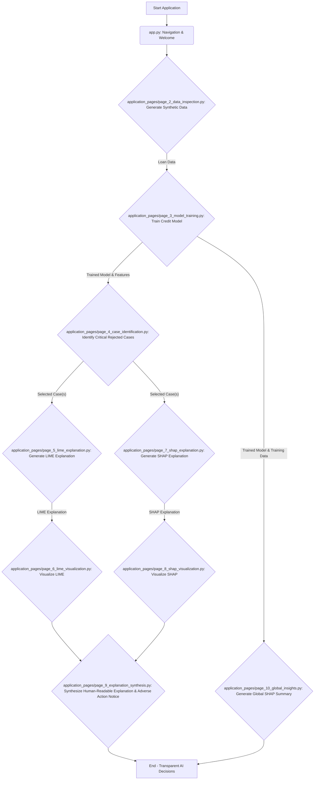

id: 6931d9c826b045777f21727c_documentation
summary: AI Design and deployment lab 5 - Clone Documentation
feedback link: https://docs.google.com/forms/d/e/1FAIpQLSfWkOK-in_bMMoHSZfcIvAeO58PAH9wrDqcxnJABHaxiDqhSA/viewform?usp=sf_link
environments: Web
status: Published
# QuLab: Explainable Credit Scoring for Regulatory Compliance

## Introduction to Explainable AI in Finance
Duration: 0:05:00

Welcome, aspiring **Quantitative Analyst**! In the rapidly evolving landscape of financial services, the use of Artificial Intelligence (AI) and Machine Learning (ML) models for critical decisions like credit scoring has become ubiquitous. While these models offer unparalleled efficiency and accuracy, their "black-box" nature often clashes with the stringent regulatory demands for transparency, fairness, and accountability.

This codelab, **QuLab: Explainable Credit Scoring**, puts you in the driver's seat of a Quantitative Analyst at a leading financial institution. Your primary mission is to navigate the complex world of regulatory scrutiny by leveraging **Explainable AI (XAI)** techniques. You will learn to demystify AI-driven credit decisions, especially those involving loan rejections, and transform complex model outputs into clear, defensible, and human-understandable explanations.

<aside class="positive">
<b>Why is this important?</b> Financial regulations (e.g., Fair Credit Reporting Act, Equal Credit Opportunity Act) mandate that consumers receive specific reasons for adverse actions. Black-box models, without XAI, make it nearly impossible to provide these legally required explanations, leading to compliance risks, reputational damage, and erosion of customer trust.
</aside>

**Key Concepts You Will Explore:**

*   **Explainable AI (XAI):** A field of AI that focuses on making AI models more transparent and understandable to humans.
*   **Local Interpretability (LIME):** Understanding *why* a model made a specific prediction for a single instance.
*   **Global Interpretability (SHAP):** Understanding the *overall* behavior and feature importance of a model across the entire dataset.
*   **Adverse Action Notices:** Formal communication to an applicant explaining the specific reasons for a denied credit application.
*   **Model Agnosticism:** XAI techniques that can be applied to any black-box machine learning model.

The Streamlit application you will be interacting with provides an end-to-end workflow to achieve these goals:

1.  **Data Inspection:** Reviewing the historical loan application data.
2.  **Model Training:** Developing a credit scoring model.
3.  **Case Identification:** Pinpointing critical rejected applications.
4.  **LIME Explanation:** Local explanation for a single case.
5.  **LIME Visualization:** Visualizing LIME insights.
6.  **SHAP Explanation:** Robust local explanation using SHAP.
7.  **SHAP Visualization:** Visualizing SHAP insights (force and dependence plots).
8.  **Explanation Synthesis:** Crafting human-readable explanations and adverse action notices.
9.  **Global Insights:** Analyzing overall model behavior.

### Application Architecture Overview

The application is built with Streamlit, organizing the workflow into distinct pages. The core logic for data generation, model training, and XAI explanations resides in `utils.py`, while `application_pages/*.py` handle the Streamlit UI for each step.

Here's a simplified flowchart illustrating the data and explanation flow:



<aside class="positive">
<b>Getting Started:</b> Ensure you have Python and Streamlit installed.
You can run the application by navigating to the root directory where `app.py` is located and running `streamlit run app.py`.
</aside>

## Step 1: Data Review - Understanding Our Loan Portfolio
Duration: 0:07:00

As a Quantitative Analyst, your first step in any inquiry is to understand the data that underpins our decisions. This page allows you to inspect the historical loan application data, which serves as the foundation for our credit scoring model. Familiarizing yourself with the features and their distributions is crucial before delving into model explanations.

**What you're trying to achieve:** Gain an initial understanding of the loan application dataset, its structure, and the types of applicants we process. This helps you to contextualize subsequent model explanations within the real-world characteristics of our customer base.

**How this page helps:** You can either generate a synthetic dataset to simulate real-world data or upload your own (for future enhancements). Inspecting the raw data and summary statistics gives you immediate insights into the scale and nature of the loan applications.

### Core Data Generation Logic (`utils.py`)

The application uses `utils.py` to generate a synthetic dataset, mimicking typical loan application features. This function creates numerical features like `credit_score`, `income`, `loan_amount`, and categorical ones like `rejection_reason`, along with a `loan_approved` target variable.

```python
import numpy as np
import pandas as pd

def generate_synthetic_data(num_samples=1000):
    np.random.seed(42)
    data = {
        "credit_score": np.random.randint(300, 850, num_samples),
        "income": np.random.randint(30000, 150000, num_samples),
        "loan_amount": np.random.randint(5000, 100000, num_samples),
        "loan_term": np.random.choice([12, 24, 36, 60], num_samples),
        "employment_duration": np.random.randint(0, 20, num_samples),
        "debt_to_income_ratio": np.random.uniform(0.1, 0.5, num_samples),
        "num_credit_lines": np.random.randint(1, 10, num_samples),
        "delinquency_2yrs": np.random.randint(0, 5, num_samples),
        "rejection_reason": np.random.choice(["High DTI", "Low Income", "Poor Credit", "Other", ""], num_samples)
    }
    df = pd.DataFrame(data)

    # Simulate a "loan_approved" target variable
    # Approval is more likely with higher credit score, income, employment duration, lower DTI
    df["loan_approved"] = (
        (df["credit_score"] > 650).astype(int) +
        (df["income"] > 60000).astype(int) +
        (df["employment_duration"] > 3).astype(int) +
        (df["debt_to_income_ratio"] < 0.3).astype(int)
    ) >= 2
    df["loan_approved"] = df["loan_approved"].astype(int)

    # Ensure some rejections align with actual "loan_approved" == 0
    df.loc[df["loan_approved"] == 0, "rejection_reason"] = np.random.choice(["High DTI", "Low Income", "Poor Credit"], size=(df["loan_approved"] == 0).sum())

    return df
```

The `loan_approved` column is derived from a simple rule-based system to ensure a realistic distribution of approvals and rejections, making the dataset suitable for training a classification model.

### Interacting with the Streamlit Page (`application_pages/page_2_data_inspection.py`)

1.  **Navigate** to "Data Inspection" using the sidebar.
2.  Click the **"Generate Synthetic Data"** button.
3.  Observe the "Raw Data Preview," "Data Description," and "Loan Approval Distribution" chart. These provide crucial initial insights into the dataset's characteristics.

```python
import streamlit as st
import pandas as pd
from utils import generate_synthetic_data

def main():
    # ... markdown content ...

    if "loan_data" not in st.session_state:
        st.session_state["loan_data"] = None
    
    st.subheader("Load Loan Application Data")
    
    col1, col2 = st.columns(2)
    with col1:
        if st.button("Generate Synthetic Data"):
            st.session_state["loan_data"] = generate_synthetic_data()
            st.success("Synthetic data generated successfully!")
    with col2:
        st.info("File upload feature will be enabled in future versions for real data.")

    if st.session_state["loan_data"] is not None:
        st.subheader("Raw Data Preview")
        st.dataframe(st.session_state["loan_data"].head())

        st.subheader("Data Description")
        st.write(st.session_state["loan_data"].describe())
        
        st.subheader("Loan Approval Distribution")
        approval_counts = st.session_state["loan_data"]["loan_approved"].value_counts().rename(index={0: "Rejected", 1: "Approved"})
        st.bar_chart(approval_counts)
    else:
        st.info("Please generate or upload data to proceed.")
```

<aside class="positive">
<b>How the underlying concept or AI method supports this action:</b> This initial data inspection is fundamental to any data science workflow. Understanding the raw data helps in identifying potential biases, feature distributions, and the overall quality of information available. While not an AI method itself, it directly informs the feature engineering and model selection processes that follow, which are critical for building a fair and accurate credit scoring model.
</aside>

## Step 2: Model Training - Building Our Credit Scoring Engine
Duration: 0:08:00

Now that you've reviewed the data, the next critical step for any Quant Analyst facing a regulatory inquiry is to demonstrate the model that powers the credit decisions. On this page, you will train a credit scoring model using the historical data. This model will then be used to predict loan approval probabilities, which we will later explain.

**What you're trying to achieve:** Establish a robust and fair credit scoring model that accurately predicts loan outcomes. This trained model is the subject of our explainability exercise, allowing us to generate explanations for its decisions.

**How this page helps:** You can initiate the training process and see immediate feedback on the model's performance. This interaction simulates the practical step of deploying or validating a model within a financial institution.

### Core Model Training Logic (`utils.py`)

The `train_credit_model` function in `utils.py` handles the splitting of data into training and testing sets, and then trains a `RandomForestClassifier` on the features.

```python
from sklearn.model_selection import train_test_split
from sklearn.ensemble import RandomForestClassifier
from sklearn.metrics import accuracy_score

def train_credit_model(df):
    features = ["credit_score", "income", "loan_amount", "loan_term", "employment_duration", "debt_to_income_ratio", "num_credit_lines", "delinquency_2yrs"]
    X = df[features]
    y = df["loan_approved"]

    X_train, X_test, y_train, y_test = train_test_split(X, y, test_size=0.2, random_state=42)

    model = RandomForestClassifier(n_estimators=100, random_state=42)
    model.fit(X_train, y_train)
    
    y_pred = model.predict(X_test)
    accuracy = accuracy_score(y_test, y_pred)

    return model, features, X_train, accuracy
```

<aside class="positive">
<b>Random Forest Classifier:</b> This ensemble learning method is chosen for its robustness, ability to handle non-linear relationships, and generally good performance. It's also well-suited for SHAP explanations due to its tree-based nature.
</aside>

### Interacting with the Streamlit Page (`application_pages/page_3_model_training.py`)

1.  **Navigate** to "Model Training."
2.  Select "Random Forest Classifier" (currently the only option).
3.  Click the **"Train Model"** button.
4.  Observe the success message and the reported model accuracy. The trained model and related data will be stored in Streamlit's session state for subsequent steps.

```python
import streamlit as st
import pandas as pd
from utils import train_credit_model

def main():
    # ... markdown content ...

    if "loan_data" not in st.session_state or st.session_state["loan_data"] is None:
        st.warning("Please go to 'Data Inspection' to load the loan data first.")
        return

    st.subheader("Train Credit Scoring Model")

    model_options = ["Random Forest Classifier"]
    selected_model = st.selectbox(
        label="Select Model Type",
        options=model_options,
        index=model_options.index("Random Forest Classifier"),
        key="model_selection"
    )

    if st.button("Train Model", key="train_model_button"):
        with st.spinner(f"Training {selected_model}... This may take a moment."):
            model, features, X_train, accuracy = train_credit_model(st.session_state["loan_data"])
            st.session_state["credit_model"] = model
            st.session_state["model_features"] = features
            st.session_state["X_train"] = X_train
            st.session_state["model_accuracy"] = accuracy
            st.success(f"{selected_model} trained successfully!")
            st.write(f"Model Accuracy: {accuracy:.2f}")

    if "credit_model" in st.session_state and st.session_state["credit_model"] is not None:
        st.subheader("Trained Model Summary")
        st.markdown(f"**Model Type:** `{selected_model}`")
        st.markdown(f"**Accuracy on Test Set:** `{st.session_state['model_accuracy']:.2f}`")
```

## Step 3: Case Identification - Pinpointing Critical Decisions
Duration: 0:06:00

With our model trained, the immediate next step in addressing a regulatory inquiry is to identify the specific cases that require detailed explanation. This often involves focusing on rejected applications, especially those where the decision might be ambiguous or has a significant impact on the applicant.

**What you're trying to achieve:** Identify and select individual loan applications that were rejected by the model, and which will be the focus of our explainability efforts using LIME and SHAP. This step is about narrowing down the scope to critical instances.

**How this page helps:** You can adjust a threshold to filter applications and then manually select specific rejected cases for deeper analysis. This mimics the real-world process of an analyst focusing on particular cases flagged for review.

### Core Case Identification Logic (`utils.py`)

The `identify_critical_applications` function helps filter down the dataset to only those applications that were rejected.

```python
def identify_critical_applications(df, model, features, threshold=0.5):
    X = df[features]
    predictions = model.predict_proba(X)[:, 1] # Probability of approval
    
    # Identify rejected applications (loan_approved == 0) that are critical for explanation
    # For simplicity, let's consider all rejected applications as critical for this scenario.
    rejected_applications = df[df["loan_approved"] == 0].copy()
    rejected_applications["predicted_probability"] = model.predict_proba(rejected_applications[features])[:, 1]
    
    return rejected_applications.sort_values(by="predicted_probability", ascending=True)
```

The function identifies applications where `loan_approved` is 0 (rejected) and then sorts them by their predicted probability of approval, making it easier to see the most confidently rejected cases.

### Interacting with the Streamlit Page (`application_pages/page_4_case_identification.py`)

1.  **Navigate** to "Case Identification."
2.  Adjust the **"Select Probability Threshold for Rejection"** slider. Applications with a predicted probability of approval $P(\text{Approved})$ below this threshold are considered for review.
3.  Review the list of "Rejected Applications."
4.  **Select** one or more checkboxes next to "Applicant ID" to choose cases for XAI analysis. These selections will be used in subsequent LIME and SHAP explanation steps.

```python
import streamlit as st
import pandas as pd
from utils import identify_critical_applications

def main():
    # ... markdown content ...

    if "credit_model" not in st.session_state or st.session_state["credit_model"] is None:
        st.warning("Please go to 'Model Training' to train a model first.")
        return
    if "loan_data" not in st.session_state or st.session_state["loan_data"] is None:
        st.warning("Please go to 'Data Inspection' to load the loan data first.")
        return

    st.subheader("Identify Critical Rejected Applications")

    model = st.session_state["credit_model"]
    loan_data = st.session_state["loan_data"]
    features = st.session_state["model_features"]

    st.markdown(
        r"""
        **Decision Threshold:** The model predicts a probability of approval. By adjusting this threshold, you can define what constitutes a "rejection" for review.
        For instance, if the predicted probability of approval $P(\text{Approved})$ falls below this threshold, the application is considered for rejection.
        """
    )
    
    prediction_threshold = st.slider(
        "Select Probability Threshold for Rejection (P(Approved) < threshold)",
        min_value=0.0, max_value=1.0, value=0.5, step=0.05,
        key="rejection_threshold"
    )

    rejected_cases = identify_critical_applications(loan_data, model, features, threshold=prediction_threshold)

    if not rejected_cases.empty:
        st.subheader(f"Rejected Applications (P(Approved) < {prediction_threshold:.2f})")
        st.markdown("Select individual cases below for detailed XAI analysis.")

        selected_indices = []
        for i, row in rejected_cases.head(10).iterrows():
            if st.checkbox(f"Applicant ID: {i} - P(Approved): {row['predicted_probability']:.4f}", key=f"select_case_{i}"):
                selected_indices.append(i)
        st.session_state["selected_rejected_cases"] = selected_indices
    else:
        st.info("No rejected cases found for the selected threshold.")
```

## Step 4: LIME Explanation - Understanding Local Decisions
Duration: 0:08:00

As a Quant Analyst, when faced with a specific rejected loan application, one of your primary tools for explanation is LIME (Local Interpretable Model-agnostic Explanations). LIME helps you understand *why* a black-box model made a particular prediction for a single instance by approximating it with an interpretable local model.

**What you're trying to achieve:** Generate a localized explanation for a chosen rejected loan application, identifying the key features that drove its individual rejection. This insight is crucial for providing specific feedback to applicants or defending a decision to regulators.

**How this page helps:** You will select a specific rejected case and trigger a LIME analysis. The output will highlight the features that were most influential in the model's decision for that particular applicant, providing a concrete, case-by-case rationale.

### Core LIME Explanation Logic (`utils.py`)

The `explain_with_lime` function uses `lime.lime_tabular.LimeTabularExplainer` to generate explanations. It creates local models around the specific prediction to show feature contributions.

```python
import lime
import lime.lime_tabular

def explain_with_lime(model, X_train, case_data, features):
    explainer = lime.lime_tabular.LimeTabularExplainer(
        training_data=X_train.values,
        feature_names=features,
        class_names=["Rejected", "Approved"],
        mode="classification"
    )
    explanation = explainer.explain_instance(
        data_row=case_data.values,
        predict_fn=model.predict_proba,
        num_features=len(features)
    )
    return explanation.as_list()
```

<aside class="negative">
<b>LIME's Locality:</b> LIME's explanations are "local." This means they are accurate only within the immediate vicinity of the instance being explained. They do not necessarily generalize to other parts of the model's decision boundary.
</aside>

### Interacting with the Streamlit Page (`application_pages/page_5_lime_explanation.py`)

1.  **Navigate** to "LIME Explanation."
2.  Select an application from the dropdown list of previously identified rejected cases.
3.  Click the **"Generate LIME Explanation"** button.
4.  Review the LIME output, which is a list of features and their corresponding weights (contributions) to the prediction.

```python
import streamlit as st
import pandas as pd
from utils import explain_with_lime

def main():
    # ... markdown content ...

    if "selected_rejected_cases" not in st.session_state or not st.session_state["selected_rejected_cases"]:
        st.warning("Please go to 'Case Identification' to select at least one rejected application first.")
        return
    # ... other session state checks ...

    st.subheader("Apply LIME to a Selected Case")

    case_options = {f"Applicant ID: {idx}": idx for idx in st.session_state["selected_rejected_cases"]}
    selected_case_id_str = st.selectbox(
        "Select an application for LIME explanation:",
        options=list(case_options.keys()),
        key="lime_case_selection"
    )
    selected_case_id = case_options[selected_case_id_str]

    application_data = st.session_state["loan_data"].loc[selected_case_id]
    model = st.session_state["credit_model"]
    features = st.session_state["model_features"]
    X_train = st.session_state["X_train"]

    st.markdown(f"**Analyzing Applicant ID:** `{selected_case_id}`")
    st.dataframe(application_data.to_frame().T)

    if st.button("Generate LIME Explanation", key="generate_lime_button"):
        with st.spinner("Generating LIME explanation..."):            
            lime_explanation_list = explain_with_lime(model, X_train, application_data[features], features)
            st.session_state[f"lime_explanation_{selected_case_id}"] = lime_explanation_list
            st.success("LIME explanation generated!")

    if f"lime_explanation_{selected_case_id}" in st.session_state:
        st.subheader(f"LIME Explanation for Applicant ID: {selected_case_id}")
        st.markdown(
            r"""
            **Interpreting LIME Output:** The list below shows features that are locally important for this specific decision.
            Each tuple `(feature, weight)` indicates how much that feature (and its value) contributes to the model's prediction for this instance.
            A positive weight suggests it pushes towards "Approved", while a negative weight pushes towards "Rejected".
            """
        )
        for feature, weight in st.session_state[f"lime_explanation_{selected_case_id}"]:
            st.write(f"- `{feature}`: `{weight:.4f}`")
```

## Step 5: LIME Visualization - Picturing Local Impact
Duration: 0:05:00

After generating a LIME explanation, visualizing the results is crucial for effective communication. As a Quant Analyst, transforming raw feature importance scores into clear plots helps stakeholders quickly grasp *why* a specific loan application was rejected or approved.

**What you're trying to achieve:** Visually represent the LIME explanation for a selected rejected loan application, making the individual feature contributions intuitive and easy to interpret. This aids in clarifying complex model behavior for a single case.

**How this page helps:** This page takes the LIME output and generates an importance plot, showing which features pushed the decision towards approval or rejection for the selected applicant. This visual evidence strengthens your explanation.

### Interacting with the Streamlit Page (`application_pages/page_6_lime_visualization.py`)

1.  **Navigate** to "LIME Visualization."
2.  Select the same (or a different) application for which you generated a LIME explanation.
3.  Observe the generated bar chart. Green bars indicate features pushing towards approval, while red bars indicate features pushing towards rejection for this specific case.

```python
import streamlit as st
import pandas as pd
import matplotlib.pyplot as plt
import seaborn as sns

def main():
    # ... markdown content ...

    if "selected_rejected_cases" not in st.session_state or not st.session_state["selected_rejected_cases"]:
        st.warning("Please go to 'Case Identification' to select at least one rejected application first.")
        return

    st.subheader("Visualize LIME Explanation for a Case")

    case_options = {f"Applicant ID: {idx}": idx for idx in st.session_state["selected_rejected_cases"]}
    if not case_options:
        st.warning("No rejected cases with LIME explanations found. Please generate LIME explanations first.")
        return

    selected_case_id_str = st.selectbox(
        "Select an application to visualize its LIME explanation:",
        options=list(case_options.keys()),
        key="lime_viz_case_selection"
    )
    selected_case_id = case_options[selected_case_id_str]

    if f"lime_explanation_{selected_case_id}" not in st.session_state:
        st.warning(f"LIME explanation for Applicant ID {selected_case_id} not found. Please generate it on the 'LIME Explanation' page first.")
        return

    lime_explanation_list = st.session_state[f"lime_explanation_{selected_case_id}"]

    st.markdown(f"**Visualizing LIME for Applicant ID:** `{selected_case_id}`")

    # Prepare data for plotting
    features = [exp[0] for exp in lime_explanation_list]
    weights = [exp[1] for exp in lime_explanation_list]

    lime_df = pd.DataFrame({
        "Feature": features,
        "Weight": weights
    })
    lime_df = lime_df.sort_values(by="Weight", ascending=False)

    fig, ax = plt.subplots(figsize=(10, 6))
    colors = ["red" if w < 0 else "green" for w in lime_df["Weight"]]
    ax.barh(lime_df["Feature"], lime_df["Weight"], color=colors)
    ax.set_xlabel("Contribution to Prediction")
    ax.set_ylabel("Feature")
    ax.set_title(f"LIME Feature Contributions for Applicant ID {selected_case_id}")
    ax.axvline(0, color="grey", linestyle="--")
    st.pyplot(fig)
    plt.close(fig)
```

<aside class="positive">
<b>Visual Communication:</b> This visualization leverages basic bar chart principles to show directed feature importance. Positive bars indicate features pushing towards the "approved" class, while negative bars push towards "rejected". This direct visual mapping allows non-technical stakeholders, like regulators or loan officers, to quickly understand the primary factors for a specific decision, fulfilling the need for transparent communication.
</aside>

## Step 6: SHAP Explanation - Deeper Dive into Feature Impact
Duration: 0:08:00

Beyond LIME's local explanations, SHAP (SHapley Additive exPlanations) provides a unified framework to explain the output of any machine learning model. As a Quant Analyst, SHAP values are incredibly powerful for understanding not just individual predictions, but also global model behavior by consistently attributing each feature's contribution to a prediction.

**What you're trying to achieve:** Apply SHAP analysis to another selected rejected loan application to gain a more robust and theoretically sound explanation of individual feature contributions. SHAP provides a rigorous method for attributing model output.

**How this page helps:** You will select a different rejected case and initiate a SHAP analysis. This will generate SHAP values that precisely quantify how much each feature contributes to pushing the model's output from the base value to the final predicted value for that instance.

### Core SHAP Explanation Logic (`utils.py`)

The `explain_with_shap` function uses `shap.TreeExplainer` for tree-based models like `RandomForestClassifier`. This explainer is very efficient and provides exact SHAP values.

```python
import shap
import numpy as np

def explain_with_shap(model, X_train, case_data):
    explainer = shap.TreeExplainer(model)
    shap_values = explainer.shap_values(case_data)
    return explainer, shap_values
```

<aside class="positive">
<b>SHAP and Game Theory:</b> SHAP values are based on cooperative game theory and Shapley values, ensuring fair distribution of prediction credit among features. This means the sum of feature contributions (SHAP values) plus a base value (the average model output for the dataset) reconstructs the actual prediction for a given instance. This robustness is highly valued in regulatory contexts.
</aside>

The fundamental equation for SHAP values is:
$$ g(z') = \phi_0 + \sum_{i=1}^{M} \phi_i z'_i $$
where $g$ is the explanation model, $z'$ is a simplified input, $\phi_0$ is the base value (expected output of the model), and $\phi_i$ are the SHAP values for the simplified input features.

### Interacting with the Streamlit Page (`application_pages/page_7_shap_explanation.py`)

1.  **Navigate** to "SHAP Explanation."
2.  Select an application (ideally a different one from the LIME example to explore various cases).
3.  Click the **"Generate SHAP Explanation"** button.
4.  Review the SHAP values in a table format. Note the `Base Value` and how the sum of SHAP values plus the base value approximates the model's raw output for the case.

```python
import streamlit as st
import pandas as pd
from utils import explain_with_shap
import shap # Import shap for explainer objects

def main():
    # ... markdown content ...

    if "selected_rejected_cases" not in st.session_state or not st.session_state["selected_rejected_cases"]:
        st.warning("Please go to 'Case Identification' to select at least one rejected application first.")
        return
    # ... other session state checks ...

    st.subheader("Apply SHAP to a Selected Case")

    case_options = {f"Applicant ID: {idx}": idx for idx in st.session_state["selected_rejected_cases"]}
    selected_case_id_str = st.selectbox(
        "Select an application for SHAP explanation (ideally a different one from LIME):",
        options=list(case_options.keys()),
        key="shap_case_selection"
    )
    selected_case_id = case_options[selected_case_id_str]

    application_data = st.session_state["loan_data"].loc[selected_case_id]
    model = st.session_state["credit_model"]
    features = st.session_state["model_features"]
    X_train = st.session_state["X_train"]

    st.markdown(f"**Analyzing Applicant ID:** `{selected_case_id}`")
    st.dataframe(application_data.to_frame().T)

    if st.button("Generate SHAP Explanation", key="generate_shap_button"):
        with st.spinner("Generating SHAP explanation... This might take a moment for larger models."):
            explainer, shap_values = explain_with_shap(model, X_train, application_data[features])
            
            # For classification, shap_values is a list of arrays (one per class). We need the explanation for the "approved" class (class 1).
            st.session_state[f"shap_explainer_{selected_case_id}"] = explainer
            st.session_state[f"shap_values_{selected_case_id}"] = shap_values[1] if isinstance(shap_values, list) else shap_values
            st.session_state[f"shap_base_value_{selected_case_id}"] = explainer.expected_value[1] if isinstance(explainer.expected_value, np.ndarray) else explainer.expected_value
            st.success("SHAP explanation generated!")

    if f"shap_explainer_{selected_case_id}" in st.session_state and f"shap_values_{selected_case_id}" in st.session_state:
        st.subheader(f"SHAP Explanation for Applicant ID: {selected_case_id}")
        st.markdown(
            r"""
            **Interpreting SHAP Values:** SHAP values represent the contribution of each feature to the prediction for a specific instance, relative to the average prediction.
            A positive SHAP value means the feature increases the prediction (e.g., towards approval), while a negative value decreases it (e.g., towards rejection).
            The sum of SHAP values plus the `base value` (average prediction) equals the model's raw output for this instance.
            """
        )
        shap_values_for_case = st.session_state[f"shap_values_{selected_case_id}"]
        base_value = st.session_state[f"shap_base_value_{selected_case_id}"]

        st.markdown(f"**Base Value (Average Model Output):** `{base_value:.4f}`")
        st.markdown(f"**Model's Predicted Probability for this Case (raw output before sigmoid):** `{base_value + shap_values_for_case.sum():.4f}`")

        shap_df = pd.DataFrame({
            "Feature": features,
            "SHAP Value": shap_values_for_case
        }).sort_values(by="SHAP Value", ascending=False)

        st.dataframe(shap_df)
```

## Step 7: SHAP Visualization - Force and Dependence Plots
Duration: 0:10:00

Visualizing SHAP explanations transforms complex numerical attributions into intuitive insights. As a Quant Analyst, using SHAP force plots and dependence plots allows you to compellingly demonstrate the impact of individual features on a specific decision, and also to understand feature interactions.

**What you're trying to achieve:** Create a SHAP force (or Waterfall) plot to visually explain a single loan application's rejection and a dependence plot to explore the relationship between a specific feature and the model's output, potentially revealing interactions. This provides a comprehensive visual argument for the model's behavior.

**How this page helps:** You will see an interactive force plot illustrating how each feature pushes the prediction from the base value. Additionally, a dependence plot will show how a chosen feature affects the outcome, allowing you to identify non-linear relationships or interactions.

### Interacting with the Streamlit Page (`application_pages/page_8_shap_visualization.py`)

1.  **Navigate** to "SHAP Visualization."
2.  Select an application for which you generated SHAP explanations.

### SHAP Waterfall Plot (Individual Explanation)

The Waterfall plot is a specific type of SHAP visualization that shows how the SHAP values for each feature sequentially push the model's prediction from the `base value` to the `final prediction` for a single instance.

```python
import streamlit as st
import pandas as pd
import shap
import matplotlib.pyplot as plt

def main():
    # ... markdown content ...

    # ... session state checks and case selection ...

    st.subheader("SHAP Force Plot (Individual Explanation)")
    st.markdown(
        r"""
        The **Waterfall Plot** visualizes how features contribute to pushing the model's output from the `base value` (average prediction)
        to the actual prediction for this specific instance. Features pushing the prediction higher (towards approval) are in red,
        and those pushing it lower (towards rejection) are in blue.
        """
    )
    fig, ax = plt.subplots(figsize=(12, 2))
    shap.waterfall_plot(shap.Explanation(values=shap_values, 
                                         base_values=base_value, 
                                         data=application_data_features.values,
                                         feature_names=st.session_state["model_features"]),
                        max_display=len(st.session_state["model_features"]), show=False)
    plt.title(f"SHAP Waterfall Plot for Applicant ID {selected_case_id}")
    st.pyplot(fig)
    plt.close(fig)
```

### SHAP Dependence Plot (Feature Interaction)

The Dependence plot shows the relationship between a single feature's value and its SHAP value. By coloring the points based on another interaction feature, you can uncover how feature interactions affect the model's output.

```python
    # ... previous code for Waterfall plot ...

    st.subheader("SHAP Dependence Plot (Feature Interaction)")
    st.markdown(
        r"""
        The **Dependence Plot** shows the relationship between a single feature and the predicted outcome, often revealing interactions with other features.
        This helps in understanding how changes in a feature's value influence the model's prediction for individual instances, and if this influence is modulated by another feature.
        """
    )

    features_for_dependence = st.session_state["model_features"]
    selected_feature = st.selectbox(
        "Select a feature for Dependence Plot:",
        options=features_for_dependence,
        index=features_for_dependence.index("credit_score"),
        key="shap_dependence_feature_selection"
    )

    interaction_features = [f for f in features_for_dependence if f != selected_feature]
    selected_interaction_feature = st.selectbox(
        "Select an interaction feature (optional):",
        options=["None"] + interaction_features,
        index=0,
        key="shap_interaction_feature_selection"
    )

    if selected_interaction_feature == "None":
        interaction_index = None
    else:
        interaction_index = selected_interaction_feature

    fig_dp, ax_dp = plt.subplots(figsize=(10, 6))
    shap.dependence_plot(
        ind=selected_feature,
        shap_values=st.session_state[f"shap_values_{selected_case_id}"],
        features=application_data_features.values,
        feature_names=st.session_state["model_features"],
        interaction_index=interaction_index,
        show=False,
        ax=ax_dp
    )
    st.pyplot(fig_dp)
    plt.close(fig_dp)
```

<aside class="positive">
<b>Uncovering Interactions:</b> The dependence plot, in the context of SHAP, displays how the SHAP value for a specific feature changes as the value of that feature changes. By coloring the points based on another feature, we can identify subtle conditional relationships within the model's behavior. This ability to visualize non-linear effects and interactions is critical for truly understanding complex model decisions and ensuring they align with financial regulations and fairness principles.
</aside>

## Step 8: Explanation Synthesis - Crafting Human-Readable Justifications
Duration: 0:12:00

The ultimate goal of explainable AI in a financial context is to translate technical insights into clear, actionable, and human-readable explanations. As a Quant Analyst, you must be able to synthesize the LIME and SHAP findings into coherent narratives for regulators, internal stakeholders, and even the applicants themselves.

**What you're trying to achieve:** Develop a comprehensive, plain-language explanation for a selected rejected loan application, drawing upon the insights gained from LIME and SHAP analysis. This involves translating feature contributions into business logic and potential recommendations.

**How this page helps:** You will select a rejected case, review its LIME and SHAP explanations (if available), and then generate a synthesized explanation. You can also add custom comments to refine the narrative, mimicking the analyst's role in crafting precise communications.

### Core Synthesis Logic (`utils.py`)

The `utils.py` file contains functions to generate human-readable explanations and adverse action notices by synthesizing the XAI outputs. Note: `create_adverse_action_notice` is a simplified placeholder for this codelab.

```python
# In utils.py
def generate_human_readable_explanation(application_data, lime_explanation=None, shap_explanation=None, threshold=0.5):
    explanation_text = f"\n**Loan Application Analysis for Applicant ID: {application_data.name}**\n"
    prediction_prob = application_data.get("predicted_probability", 0.0) # Use actual predicted probability if available

    if prediction_prob < threshold: # Assuming a lower probability indicates rejection
        explanation_text += "\n**Decision:** Declined\n"
        explanation_text += f"\nBased on our model, the probability of approval for this application was low ($P(\\text{{Approved}}) = {prediction_prob:.4f}$). The primary factors contributing to this decision include:\n"
    else:
        explanation_text += "\n**Decision:** Approved\n"
        explanation_text += f"\nBased on our model, the probability of approval for this application was high ($P(\\text{{Approved}}) = {prediction_prob:.4f}$). Key factors supporting this decision include:\n"

    # Incorporate LIME insights
    if lime_explanation:
        explanation_text += "\n**LIME Insights (Local Feature Impact):**\n"
        # For simplicity, filter for top contributing features towards rejection/approval
        sorted_lime = sorted(lime_explanation, key=lambda x: x[1], reverse=True)
        top_positive = [f"{feat} ({weight:.2f})" for feat, weight in sorted_lime if weight > 0][:3]
        top_negative = [f"{feat} ({weight:.2f})" for feat, weight in sorted_lime if weight < 0][:3]
        
        if top_negative and prediction_prob < threshold:
            explanation_text += "- Features that significantly *decreased* the likelihood of approval:\n"
            for item in top_negative: explanation_text += f"  - {item}\n"
        elif top_positive and prediction_prob >= threshold:
            explanation_text += "- Features that significantly *increased* the likelihood of approval:\n"
            for item in top_positive: explanation_text += f"  - {item}\n"
        
        # Add a general statement about current feature values
        explanation_text += "\n*Current application values that influenced the decision:*\n"
        for feature in application_data.index:
            if feature not in ["loan_approved", "rejection_reason", "predicted_probability"]:
                explanation_text += f"- **{feature.replace('_', ' ').title()}:** {application_data[feature]}\n"

    # Incorporate SHAP insights
    if shap_explanation is not None and not shap_explanation.empty:
        explanation_text += "\n**SHAP Insights (Feature Contribution Relative to Average):**\n"
        # Filter for top N features by absolute SHAP value
        shap_explanation["Abs_SHAP"] = shap_explanation["SHAP Value"].abs()
        sorted_shap = shap_explanation.sort_values(by="Abs_SHAP", ascending=False).head(3)
        
        for _, row in sorted_shap.iterrows():
            direction = "increased" if row["SHAP Value"] > 0 else "decreased"
            explanation_text += f"- **{row['Feature']}:** This feature {direction} the likelihood of approval by approximately `{row['SHAP Value']:.2f}` points relative to the average application.\n"

    # Default rejection reasons if no specific XAI insights are prominent or for general context
    if prediction_prob < threshold and application_data["rejection_reason"] != "":
        explanation_text += f"\n**Additional Context:** The system also flagged this application with the rejection reason: '{application_data['rejection_reason']}'.\n"

    explanation_text += "\n"
    return explanation_text

def create_adverse_action_notice(application_data, final_explanation):
    notice = f"**Adverse Action Notice for Loan Application (Applicant ID: {application_data.name})**\n\n"
    notice += "Dear Applicant,\n\n"
    notice += "We regret to inform you that your application for a loan has been declined.\n\n"
    notice += "This decision was based on information obtained from your application. The primary factors contributing to this decision were:\n\n"
    # Extract key reasons from the final_explanation. This is a simplified extraction.
    # In a real system, you'd parse `final_explanation` to get the top negative factors directly.
    # For this demo, we'll just present the relevant part of the explanation.
    
    # Extracting a summarized reason for adverse action from the full explanation
    reason_lines = []
    if "The primary factors contributing to this decision include:" in final_explanation:
        start_index = final_explanation.find("The primary factors contributing to this decision include:") + len("The primary factors contributing to this decision include:")
        end_index_lime = final_explanation.find("\n**SHAP Insights", start_index)
        end_index_shap = final_explanation.find("\n**Additional Context", start_index)
        end_index = min(idx for idx in [end_index_lime, end_index_shap] if idx != -1) if any(idx != -1 for idx in [end_index_lime, end_index_shap]) else len(final_explanation)
        
        extracted_reasons = final_explanation[start_index:end_index].strip()
        if extracted_reasons:
            notice += extracted_reasons
        else:
            notice += "- Specific reasons derived from our credit model analysis.\n"
    else:
         notice += "- Specific reasons derived from our credit model analysis.\n"

    if application_data.get("rejection_reason") and application_data["rejection_reason"] != "":
         notice += f"\n- Furthermore, the application was flagged for: {application_data['rejection_reason']}.\n"

    notice += "\n\nIf you have any questions or wish to discuss this decision, please contact us."
    return notice
```

### Interacting with the Streamlit Page (`application_pages/page_9_explanation_synthesis.py`)

1.  **Navigate** to "Explanation Synthesis."
2.  Select a rejected application. You'll see its raw data and, if available, the LIME and SHAP explanations from previous steps.
3.  Add any **custom comments** or refinements to the explanation in the provided text area.
4.  Click **"Generate Final Explanation & Adverse Action Notice."**
5.  Review the synthesized explanation and the adverse action notice.
6.  Use the **"Download Explanation as Text"** and **"Download Adverse Action Notice as Text"** buttons to save these documents.

<button>
  [Download Explanation as Text](javascript:void(0))
</button>
<button>
  [Download Adverse Action Notice as Text](javascript:void(0))
</button>

```python
import streamlit as st
import pandas as pd
from utils import generate_human_readable_explanation, create_adverse_action_notice

def main():
    # ... markdown content ...

    # ... session state checks and case selection ...

    application_data = st.session_state["loan_data"].loc[selected_case_id]

    st.markdown(f"**Application Details for Applicant ID:** `{selected_case_id}`")
    st.dataframe(application_data.to_frame().T)

    lime_exp = st.session_state.get(f"lime_explanation_{selected_case_id}", None)
    shap_exp = None
    if f"shap_values_{selected_case_id}" in st.session_state:
        shap_exp = pd.DataFrame({
            "Feature": st.session_state["model_features"],
            "SHAP Value": st.session_state[f"shap_values_{selected_case_id}"]
        }).sort_values(by="SHAP Value", ascending=False)

    st.markdown("")
    st.subheader("Review Explanations (LIME & SHAP)")
    
    if lime_exp:
        st.markdown("#### LIME Insights:")
        for feature, weight in lime_exp:
            st.write(f"- `{feature}`: `{weight:.4f}`")
    else:
        st.info("No LIME explanation found for this case. Please generate it on the 'LIME Explanation' page.")
    
    if shap_exp is not None:
        st.markdown("#### SHAP Insights:")
        st.dataframe(shap_exp)
    else:
        st.info("No SHAP explanation found for this case. Please generate it on the 'SHAP Explanation' page.")

    st.markdown("")
    st.subheader("Craft Your Human-Readable Explanation")

    custom_comments = st.text_area(
        "Add specific comments or refine the explanation for stakeholders (e.g., policy implications, next steps for applicant):",
        height=150,
        key="custom_explanation_comments"
    )

    if st.button("Generate Final Explanation & Adverse Action Notice", key="generate_final_explanation_button"):
        with st.spinner("Generating synthesized explanation..."):            
            final_explanation = generate_human_readable_explanation(application_data, lime_explanation=lime_exp, shap_explanation=shap_exp)
            if custom_comments:
                final_explanation += f"\n\n**Analyst's Additional Comments:**\n{custom_comments}"

            st.session_state[f"final_explanation_{selected_case_id}"] = final_explanation
            
            adverse_notice = create_adverse_action_notice(application_data, final_explanation)
            st.session_state[f"adverse_action_notice_{selected_case_id}"] = adverse_notice
            
            st.success("Explanation and Adverse Action Notice generated!")

    if f"final_explanation_{selected_case_id}" in st.session_state:
        st.subheader(f"Synthesized Explanation for Applicant ID: {selected_case_id}")
        st.markdown(st.session_state[f"final_explanation_{selected_case_id}"])

        st.subheader(f"Adverse Action Notice for Applicant ID: {selected_case_id}")
        st.markdown(st.session_state[f"adverse_action_notice_{selected_case_id}"])
        
        st.download_button(
            label="Download Explanation as Text",
            data=st.session_state[f"final_explanation_{selected_case_id}"],
            file_name=f"explanation_applicant_{selected_case_id}.txt",
            mime="text/plain",
            key="download_explanation"
        )
        st.download_button(
            label="Download Adverse Action Notice as Text",
            data=st.session_state[f"adverse_action_notice_{selected_case_id}"],
            file_name=f"adverse_action_notice_{selected_case_id}.txt",
            mime="text/plain",
            key="download_adverse_notice"
        )
```

<aside class="positive">
<b>Regulatory Compliance:</b> This step is where the theoretical aspects of XAI (LIME and SHAP) are translated into practical, enforceable business outcomes. By combining quantified feature impacts with qualitative reasoning (your comments), you create a robust justification. This directly supports regulatory compliance by ensuring that all decisions, especially adverse ones, are transparent, understandable, and defensible, building trust and fairness in AI systems.
</aside>

## Step 9: Global Insights - Understanding Overall Feature Impact
Duration: 0:07:00

While individual explanations (LIME and SHAP for specific cases) are crucial for justifying single decisions, as a Quant Analyst, you also need to understand the *overall* behavior of the credit scoring model. Global interpretability, often achieved with SHAP summary plots, helps in identifying the most influential features across the entire dataset, which is vital for model validation, development, and high-level regulatory reporting.

**What you're trying to achieve:** Gain insights into which features are most important for the model's predictions across all loan applications, and how these features generally influence the outcome (e.g., positive or negative correlation with approval). This informs broader policy decisions and model improvements.

**How this page helps:** This page generates a SHAP summary plot, providing a birds-eye view of feature importance. It helps you answer questions like, "Which are the top 5 factors driving loan approvals or rejections in general?"

### Interacting with the Streamlit Page (`application_pages/page_10_global_insights.py`)

1.  **Navigate** to "Global Insights."
2.  Click **"Generate Global SHAP Summary Plot."** This will compute SHAP values for the entire training dataset (or a large sample) to derive overall feature importance.
3.  Observe the generated SHAP Summary Plot.

```python
import streamlit as st
import pandas as pd
import shap
import matplotlib.pyplot as plt

def main():
    # ... markdown content ...

    if "credit_model" not in st.session_state or st.session_state["credit_model"] is None:
        st.warning("Please go to 'Model Training' to train a model first.")
        return
    if "X_train" not in st.session_state or st.session_state["X_train"] is None:
        st.warning("Training data (X_train) not found in session state. Please retrain the model.")
        return

    st.subheader("Global Feature Importance with SHAP Summary Plot")

    model = st.session_state["credit_model"]
    X_train = st.session_state["X_train"]
    features = st.session_state["model_features"]

    st.markdown(
        r"""
        To generate global insights, we compute SHAP values for a significant portion of the training data.
        This provides a comprehensive view of how each feature influences the model's output overall.

        **SHAP Summary Plot:**
        - Each point on the plot is a Shapley value for a feature and an instance.
        - The position on the x-axis shows the SHAP value (impact on model output).
        - Color indicates the feature value (e.g., red for high, blue for low).
        - Vertical dispersion shows interaction effects.
        """
    )

    if st.button("Generate Global SHAP Summary Plot", key="generate_global_shap_button"):
        with st.spinner("Calculating global SHAP values and generating plot... This may take a while for large datasets."):
            explainer = shap.TreeExplainer(model)
            shap_values_global = explainer.shap_values(X_train)

            if isinstance(shap_values_global, list):
                shap_values_for_plot = shap_values_global[1]
            else:
                shap_values_for_plot = shap_values_global
            
            st.session_state["global_shap_values"] = shap_values_for_plot
            st.session_state["global_shap_data"] = X_train
            st.success("Global SHAP values calculated!")

    if "global_shap_values" in st.session_state and "global_shap_data" in st.session_state:
        st.subheader("Overall Feature Impact")
        fig_summary, ax_summary = plt.subplots(figsize=(10, 8))
        shap.summary_plot(st.session_state["global_shap_values"], st.session_state["global_shap_data"], feature_names=features, show=False)
        st.pyplot(fig_summary)
        plt.close(fig_summary)
```

<aside class="positive">
<b>Strategic Value:</b> The SHAP summary plot condenses the insights from thousands of individual SHAP explanations into a single visualization. It shows not only which features are most important globally, but also the direction of their impact (positive or negative) and their distribution of impact values. This global view is indispensable for model development teams to ensure feature importance aligns with domain expertise, for risk management to assess overall model fairness, and for regulators who require a high-level understanding of model drivers.
</aside>
